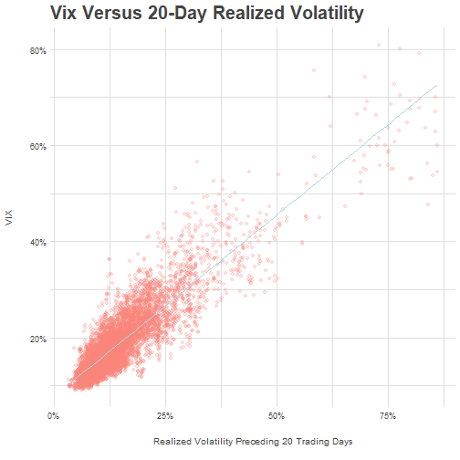
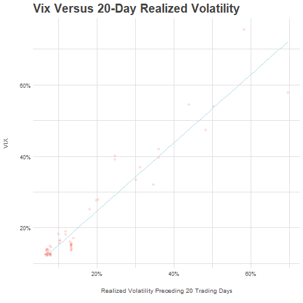
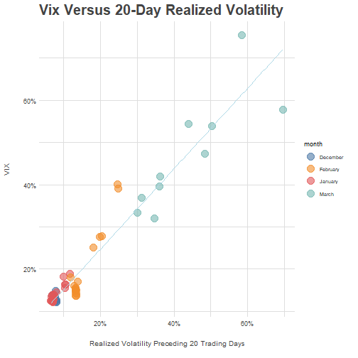
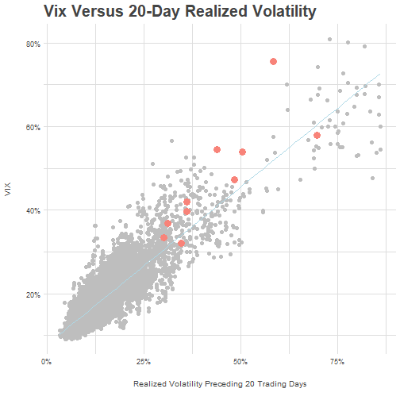

```r

library(tidyverse)
library(awtools)
library(showtext)
library(extrafont)
library(tidyquant)
library(janitor)
library(RcppRoll)
library(ggthemes)
library(hrbrthemes)
library(broom)

font_add_google("IBM Plex Mono", "IBM Plex Mono")
font_add_google("IBM Plex Sans", "IBM Plex Sans")

showtext_auto()
```

## The VIX Fear Gauge Is Soaring

So reads the start of a Barron's article from 4 days ago. With fears of the impact of the coronavirus on investor's minds, markets have been particularly volatile and the CBOE Volatility Index is hitting levels that haven't been seen since the 2008 crisis. This inagural FinViz blog post will replicate articles by Jonathan Regenstein on his blog, reproduciblefinance.com, investigating the relationship between the VIX and both past and realized volatility of the S&P 500.

The main finding from those posts, and the AQR work it was derived from, is that the VIX is strictly a measure of recent realized volatility, and nothing more than that.

To start, we import prices for the S&P 500 and the VIX.


```r
symbols = c("^GSPC","^VIX")

prices_tq = symbols %>% 
  tq_get(get = "stock.prices", from = "1990-01-01")
```

As was done in Jonathan's blog, we create new variables for returns, 20-day volatility, and the annualized 20-day volatility with the below:


```r
sp500_vix_rolling_vol = 
  prices_tq %>%  
  select(symbol, date, close) %>% 
  spread(symbol, close) %>% 
  clean_names() %>% 
  mutate(sp500_returns = gspc/lag(gspc, 1) - 1,
         sp500_roll_20 = RcppRoll::roll_sd(sp500_returns, 20, fill = NA, align = "right"),
         sp500_roll_20_annualized = (round((sqrt(252) * sp500_roll_20 * 100), 2))) %>% 
  na.omit()
```
Let's take a look at a scatterplot showing the annualized 20-day volatility versus the VIX. We'll see that there's a pretty strong relationship between the preceding volatility and the VIX.


```r
sp500_vix_rolling_vol %>%
  ggplot(aes(x = sp500_roll_20_annualized, y = vix)) +
  geom_point(colour = "#f88379", alpha = 0.2) +
  geom_smooth(method = 'lm', se = FALSE, color = "light blue", size = .5) +
  labs(title = "Vix Versus 20-Day Realized Volatility", x= "Realized Volatility Preceding 20 Trading Days", y= "VIX") +
  scale_y_continuous(labels = function(x){ paste0(x, "%") }) +
  scale_x_continuous(labels = function(x){ paste0(x, "%") }) +
  a_plex_theme()
## `geom_smooth()` using formula 'y ~ x'
```


Let's take a look at the past 3 months.


```r
sp500_vix_rolling_vol %>%
  group_by(date) %>% 
  filter(date >= Sys.Date() - months(3)) %>% 
  ggplot(aes(x = sp500_roll_20_annualized, y = vix)) +
  geom_point(colour = "#f88379", alpha = 0.2) +
  geom_smooth(method = 'lm', se = FALSE, color = "light blue", size = .5) +
  labs(title = "Vix Versus 20-Day Realized Volatility", x= "Realized Volatility Preceding 20 Trading Days", y= "VIX") +
  ylim(0,80) +
  xlim(0,80) +
  scale_y_continuous(labels = function(x){ paste0(x, "%") }) +
  scale_x_continuous(labels = function(x){ paste0(x, "%") }) +
  a_plex_theme() 
## Scale for 'y' is already present. Adding another scale for 'y', which will replace the existing scale.
## Scale for 'x' is already present. Adding another scale for 'x', which will replace the existing scale.
## `geom_smooth()` using formula 'y ~ x'
```


We'll see that most of the data points are clustered in the bottom left, with low realized volatility and a low VIX. The rest of the data points start to move up and to the right to very high volatility/VIX figures. It's pretty likely that these are data points in March as markets have grown more fearful - let's code our data points by month to provide some more clarity.


```r
sp500_vix_rolling_vol %>%
  group_by(date) %>% 
  filter(date >= Sys.Date() - months(3)) %>% 
  mutate(month = month(date)) %>%
  mutate(month = case_when(month == 12 ~ "December",
                           month == 1 ~ "January",
                           month == 2 ~ "February",
                           month == 3 ~ "March")) %>% 
  ggplot(aes(x = sp500_roll_20_annualized, y = vix)) +
  geom_point(aes(color = month), size = 5, alpha = 0.6) +
  scale_color_tableau() +
  geom_smooth(method = 'lm', se = FALSE, color = "light blue", size = .5) +
  labs(title = "Vix Versus 20-Day Realized Volatility", x= "Realized Volatility Preceding 20 Trading Days", y= "VIX") +
  ylim(0,80) +
  xlim(0,80) +
  scale_y_continuous(labels = function(x){ paste0(x, "%") }) +
  scale_x_continuous(labels = function(x){ paste0(x, "%") }) +
  a_plex_theme() 
## Scale for 'y' is already present. Adding another scale for 'y', which will replace the existing scale.
## Scale for 'x' is already present. Adding another scale for 'x', which will replace the existing scale.
## `geom_smooth()` using formula 'y ~ x'
```



As we expected, we're seeing much higher levels of realized volatility and VIX as the year has progressed. Let's do one final plot and give special attention to our volatile March data by removing our filter and using color.

```r
sp500_vix_rolling_vol %>%
  mutate(indicator = case_when(date>= '2020-03-01' ~ "#f88379",
                               TRUE ~ "grey")) %>% 
  ggplot(aes(x = sp500_roll_20_annualized, y = vix)) +
  geom_point(aes(color = indicator, size = indicator)) +
  scale_size_manual(values = c(4,2)) +
  scale_color_manual(values = c("#f88379","grey")) +
  geom_smooth(method = 'lm', se = FALSE, color = "light blue", size = .5) +
  labs(title = "Vix Versus 20-Day Realized Volatility", x= "Realized Volatility Preceding 20 Trading Days", y= "VIX") +
  scale_y_continuous(labels = function(x){ paste0(x, "%") }) +
  scale_x_continuous(labels = function(x){ paste0(x, "%") }) +
  a_plex_theme() +
  theme(legend.position = "none")
## `geom_smooth()` using formula 'y ~ x'
```


Some of the March obvservations appear pretty high in both realized volatility and VIX, but for other observations, these don't appear as drastic in the context of our historical data. We can also run a linear model as is done in the original AQR work, and we find a similar R squared as in that and Jonathan's work.


```r
sp500_vix_rolling_vol %>% 
  do(model_20 = lm(vix ~ sp500_roll_20_annualized, data = .)) %>% 
  tidy(model_20)
```

```r
sp500_vix_rolling_vol %>% 
  do(model_20 = lm(vix ~ sp500_roll_20_annualized, data = .)) %>% 
  glance(model_20) %>% 
  select(r.squared)
```


